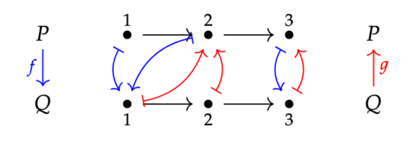
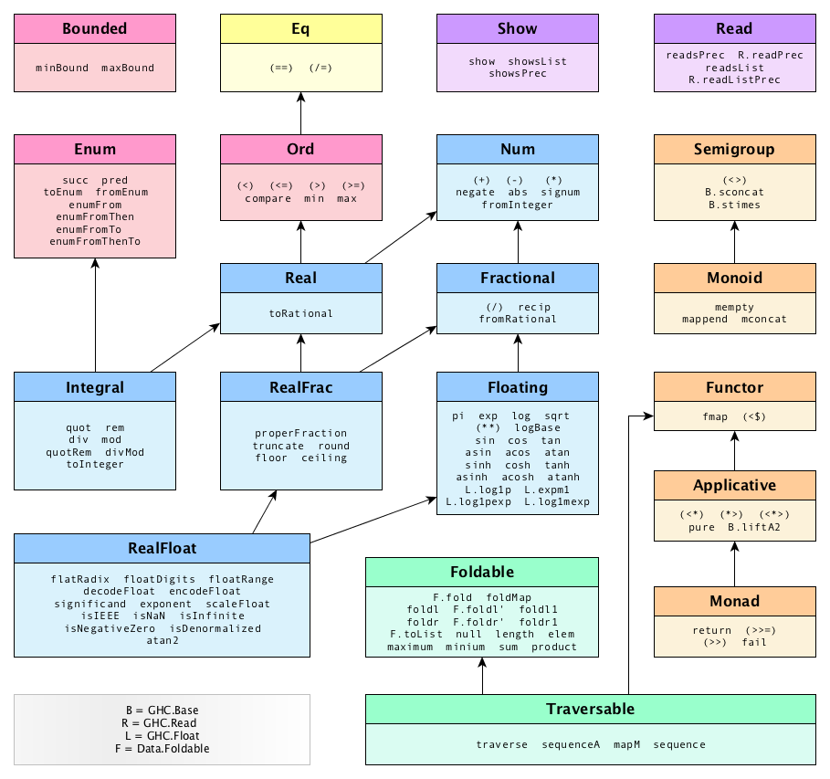

# connections

[](https://travis-ci.com/cmk/connections)

`connections` is a library for working with Galois connections on various common preorders.

Hosted on [Hackage](https://hackage.haskell.org/package/connections).

* [What is a connection?](#intro)
* [What can you do with them?](#what)
* [What's wrong with the numeric conversions in `base`?](#base)

Note that this file contains markdown syntax that doesn't render on Hackage.
A fully rendered version is hosted on Github [here](https://github.com/cmk/connections/blob/master/README.md).

### What is a connection? <a name="intro"></a>

A [Galois connection](https://en.wikipedia.org/wiki/Galois_connection) between preorders P and Q is a pair of monotone maps `f :: p -> q` and `g :: q -> p` such that `f x <= y` if and only if `x <= g y`. We say that `f` is the left or lower adjoint, and `g` is the right or upper adjoint of the connection.

For illustration, here is a simple example from [7 Sketches](https://math.mit.edu/~dspivak/teaching/sp18/7Sketches.pdf):



Connections are useful for performing lawful conversions between different types [among other things](#what). This library provides connections between common types, combinators & accessors, including lawful versions of [`floor`](https://hackage.haskell.org/package/connections/docs/Data-Connection-Cast.html#v:floor), [`ceiling`](https://hackage.haskell.org/package/connections/docs/Data-Connection-Cast.html#v:ceiling), [`round`](https://hackage.haskell.org/package/connections/docs/Data-Connection-Cast.html#v:round), and [`truncate`](https://hackage.haskell.org/package/connections/docs/Data-Connection-Cast.html#v:truncate).

There is also a [class](https://hackage.haskell.org/package/connections/docs/Data-Connection-Class.html#t:Connection) with lawful versions of `fromInteger` and `fromRational`, suitable for use with `-XRebindableSyntax`

Lastly, it provides [lattices and algebras](https://hackage.haskell.org/package/connections/docs/Data-Lattice.html).

### How do connections work?

Let's look at a simple connection between `Ordering` and `Bool`:

```
ordbin :: Cast 'L Ordering Bool
ordbin = CastL f g where
  f LT = False
  f _  = True
 
  g False = LT
  g True = GT
```

The two component functions are each monotonic (i.e. `x1 <= x2` implies `f x1 <= f x2`), and are 'interlocked' or adjoint in the specific way outlined above: `f x <= y` if and only if `x <= g y`. 

We can easily verify the adjointness property by hand in this case:

`f`/`g`| `False` | `True`  |
------ | ------- | ------- |
 `LT`  | `=`/`=` | `<`/`<` |
 `EQ`  | `>`/`>` | `=`/`<` |
 `GT`  | `>`/`>` | `=`/`=` |

Each cell represents a pairing of (`x`,`y`) with the two relations `f x _ y` and `x _ g y`. A cell with either `=`/`>`, `>`/`=`, or arrows facing in opposite directions would indictate a failure. See the `test` folder for further examples.

Interestingly, there is a second 'flipped' connection available as well, where the same `g` can serve as the lower end:

```
binord :: Cast 'L Bool Ordering
binord = CastL g h where
  g False = LT
  g True  = GT
  
  h GT = True
  h _  = False
```

It turns out that this situation happens fairly frequently- the three functions are called an adjoint [string](https://ncatlab.org/nlab/show/adjoint+string) or chain of length 3 (i.e. `f` is adjoint to `g` is adjoint to `h`). It is useful to be able to work with these length-3 chains directly, because the choice of two routes back from P to Q is what enables lawful rounding and truncation. 

Therefore the connection type in `Data.Connection.Cast` is parametrized over a data kind (e.g. `'L`) that specifies which pair we are talking about (`f`/`g` or `g`/`h`). When a chain is available the data kind is existentialized (see the view pattern `Cast`).

In our example above, it turns out that a small change in the adjoints on each side enables such a chain:

```
ordbin :: Cast k Ordering Bool
ordbin = Cast f g h
  where
    f LT = False
    f _  = True
        
    g False = LT
    g True = GT
    
    h GT = True
    h _  = False
```

Once again we can check the adjointness property for each of the two connections (`f`/`g` or `g`/`h`):
 
 `f`/`g`/`h` |   `False`   |    `True`   |
------------ | ----------- | ----------- |
 `LT`        | `=`/`=`/`=` | `<`/`<`/`<` |
 `EQ`        | `>`/`>`/`=` | `=`/`<`/`<` |
 `GT`        | `>`/`>`/`>` | `=`/`=`/`=` |


See [`Data.Connection.Property`](https://hackage.haskell.org/package/connections/docs/Data-Connection-Property.html) for a list of properties that all connections should satisfy.


### What can you do with them? <a name="what"></a>

Lots of things!

At a basic level connections can tell you interesting things about the underlying types themselves:

```
λ> import Data.Connection
λ> inner ratf32 (1 / 8)    -- eighths are exactly representable in a float
1 % 8
λ> outer ratf32 (1 % 8)
(0.125,0.125)
λ> inner ratf32 (1 / 7)    -- sevenths are not
9586981 % 67108864
λ> outer ratf32 (1 % 7)
(0.14285713,0.14285715)
```

You can use them to safely convert between types obviously:

```
λ> :t ceiling f64w32
ceiling f64w32 :: Double -> Extended Word32
λ> ceiling f64w32 pi
Finite 4
λ> ceiling f64w32 (0/0)
PosInf
λ> floor f64w32 (0/0)
NegInf
```

... as well as to round, truncate, take medians, etc.

```
λ> round f64w32 pi
Finite 3
λ> round f64w32 (-pi)
Finite 0
λ> round f64i32 (-pi)
Finite (-3)
λ> median f32f32 1 9 7
7.0
λ> median f32f32 1 9 (-1/0)
1.0
λ> median f32f32 1 9 (0/0)
9.0
λ> median f32f32 1 9 (1/0)
9.0
```

You can also lift functions over connections: 

```
λ> :t round1 f64f32
round1 f64f32 :: (Double -> Double) -> Float -> Float
λ> f x = let m = 16777215 in (m + x) - m
λ> f 2.0 :: Float
1.0
λ> round1 f64f32 f 2.0  -- Avoid loss of precision
2.0
```

... and use various combinators to combine them:

```
λ> :t divide rati16 f32i16
divide rati16 f32i16 :: Cast k (Rational, Float) (Extended Int16)
λ> maximize (divide rati16 f32i16) 2.99 3.01
Finite 4
λ> maximize (divide rati16 f32i16) 2.99 (0/0)
PosInf
λ> minimize (divide rati16 f32i16) 2.99 (0/0)
NegInf
```

In particular connections form a category, which means they compose:

```
λ> :t MkSystemTime
MkSystemTime :: Int64 -> Word32 -> SystemTime
λ> :t swapL ratf64 >>> ratsys
swapL ratf64 >>> ratsys :: Cast 'L Double (Extended SystemTime)
λ> ceiling (swapL ratf64 >>> ratsys) pi
Finite (MkSystemTime {systemSeconds = 3, systemNanoseconds = 141592654})
λ> diffSystemTime x y = inner (swapL ratf64 >>> ratsys) $ round2 ratsys (-) (Finite x) (Finite y)
λ> :t diffSystemTime
diffSystemTime :: SystemTime -> SystemTime -> Double
λ> diffSystemTime (MkSystemTime 0 0) (MkSystemTime 0 maxBound)
-4.294967295
λ> divMod (maxBound @Word32) (10^9)
(4,294967295)
```


### What's wrong with the numeric conversions in `base`? <a name="base"></a>

From an industrial user's perspective, `base` is unfortunately in pretty bad shape. Every class in the image below not colored yellow or orange has problems in my opinion. Every 'numerical' class (blue or pink) has serious problems either in the interface, the instances, or both.



With respect to numerical conversions there are two classes of problem: 

* the non-integral instances of `Ord` (e.g. `Float`, `Double`, `Rational`, `Scientific`, etc.)
* the interfaces of `Integral`, `Num`, `Real`, `Fractional`, and `RealFrac`


#### Orders: total and partial 

The root problem here is quite old: `NaN` values (e.g. `0/0`, `0 * 1/0`, `1/0 - 1/0`, etc) are not comparable to any finite number, so fractional and floating point types cannot be totally ordered.

However the `Ord` instances of `Float`, `Double`, and `Rational` ignore this, leading to nonsensical behavior:

```
λ> import GHC.Real (Ratio(..))
λ> 0 :% 0 < -1
False
λ> 0 :% 0 == -1
False
λ> 0 :% 0 <= -1
True
λ> compare @Float (0/0) (1/0)
GT
λ> compare @Float (1/0) (0/0)
GT
λ> max @Float 0 (-0.0) 
-0.0
λ> max @Float (-0.0) 0
0.0
```

The behavior isn't consistent accross types either:

```
λ> 0 :% 0 <= 0 :% 0
True
λ> (0/0 :: Float) <= 0/0
False
```

This is dangerous and can lead to bugs [well outside of numerical applications](https://github.com/ocaml/ocaml/issues/5222). Fortunately the solution is fairly simple: create a [`Preorder`](https://hackage.haskell.org/package/connections/docs/Data-Order.html#t:Preorder) class with lawful instances for types with `NaN` values. Rust does something [similar](https://doc.rust-lang.org/std/cmp/trait.PartialOrd.html).


#### Coercive conversions

The second set of problems is with the various conversion methods defined in `Integral`, `Num`, `Real` and `Fractional`:

```
fromInteger :: Num a => Integer -> a
toInteger :: Integral a => a -> Integer
fromRational :: Fractional a => Rational -> a
toRational :: Real a => a -> Rational
```

The problem with the conversion methods is that they are all lawless: the classes do not define any equational laws that the user can expect instances to obey. Predictably, the result is chaos:

```
λ> toInteger @Int8 128
-128
λ> fromInteger @Int8 128
-128
λ> toRational @Float (0/0)
(-510423550381407695195061911147652317184) % 1
λ> fromRational @Float (0/0)
*** Exception: Ratio has zero denominator
```

One could object that the examples above are exceptional. Unfortunately, surprises can occur in completely mundane situations as well:

```
λ> fromRational @Float 5000000.2 -- your fintech app is under-charging 20¢ on every $5M transaction
5000000.0
λ> fromRational @Float 5000000.3 -- or is it over-charging 20¢?
5000000.5
```

Worse, these conversion methods in turn give rise to the aptly-named [coercions](hackage.haskell.org/package/base/docs/src/GHC-Real.html#fromIntegral):

```
realToFrac :: (Real a, Fractional b) => a -> b
realToFrac = fromRational . toRational

fromIntegral :: (Integral a, Num b) => a -> b
fromIntegral = fromInteger . toInteger
```

If you're not careful, these 'just make it type-check' functions will get slotted in everywhere in your application. Sometimes that's ok, but if your application has to deal with small, large, infinite, or otherwise exceptional values then the resultant behavior will make your (or somebody's) life miserable:

```
λ> realToFrac @Float @Double (1/0)
3.402823669209385e38
λ> realToFrac @Double @Float (1/0)
Infinity
λ> realToFrac @Rational @Double (1 :% 0)
Infinity
λ> realToFrac @Double @Rational (1/0)
179769313486231590772930519078902473361797697894230657273430081157732675805500963132708477322407536021120113879871393357658789768814416622492847430639474124377767893424865485276302219601246094119453082952085005768838150682342462881473913110540827237163350510684586298239947245938479716304835356329624224137216 % 1
λ> fromIntegral @Int8 @Word8 128
128
λ> fromIntegral @Int8 @Word 128
18446744073709551488
λ> fromIntegral @Int8 @Natural 128 -- your colleagues will appreciate this _underflow_ exception 
*** Exception: arithmetic underflow
```

What happened in that last example to create an underflow exception? If anything you would expect overflow. 

This is what happened:

```
λ> toInteger @Int8 128
-128
λ> fromInteger @Natural (-128)
*** Exception: arithmetic underflow
```

It's a good example of why composition is only your friend if it comes with composable guarantees. 


Finally, let's look at [`RealFrac`](www.hackage.haskell.org/package/base/docs/GHC-Real.html#t:RealFrac):

```  
-- | Extracting components of fractions.
class  (Real a, Fractional a) => RealFrac a where

    -- | The function 'properFraction' takes a real fractional number @x@
    -- and returns a pair @(n,f)@ such that @x = n+f@, and:
    --
    -- * @n@ is an integral number with the same sign as @x@; and
    --
    -- * @f@ is a fraction with the same type and sign as @x@,
    --   and with absolute value less than @1@.
    --
    -- The default definitions of the 'ceiling', 'floor', 'truncate'
    -- and 'round' functions are in terms of 'properFraction'.
    properFraction      :: (Integral b) => a -> (b,a)
    
    -- | @'truncate' x@ returns the integer nearest @x@ between zero and @x@
    truncate            :: (Integral b) => a -> b
    
    -- | @'round' x@ returns the nearest integer to @x@;
    --   the even integer if @x@ is equidistant between two integers
    round               :: (Integral b) => a -> b
    
    -- | @'ceiling' x@ returns the least integer not less than @x@
    ceiling             :: (Integral b) => a -> b
    
    -- | @'floor' x@ returns the greatest integer not greater than @x@
    floor               :: (Integral b) => a -> b

    {-# MINIMAL properFraction #-}
```

By now you might be suspicious of these claims. If so, your suspicion would be rewarded:


```
λ> properFraction @Float @Int 3000000.1
(3000000,0.0)
λ> ceiling @Float @Int 3000000.1
3000000
```

The situation again is especially bad for floating point types, which are forced to go through `Integer` and/or `Rational`:

```
λ> properFraction @Float @Int (1/0)
(0,0.0)
λ> ceiling @Float @Int (1/0)
0
λ> properFraction @Float @Integer (1/0)
(340282366920938463463374607431768211456,0.0)
λ> ceiling @Float @Integer (1/0)
340282366920938463463374607431768211456
λ> realToFrac @Float @Rational (1/0)
340282366920938463463374607431768211456 % 1
```

Even conversions between `Float` and `Double`, which should be straightforward, are impacted:

```
λ> realToFrac @Float @Double (1/0)
3.402823669209385e38
λ> import GHC.Float (float2Double)
λ> float2Double (1/0)
Infinity
```

The meta-problem behind all of these problems is the mis-specification of the numeric type classes in `base`. Functions that can only be meaningfully given laws in pairs (like `toRational` and `fromRational`) are instead broken up between different classes, laws are either non-existant or (worse) misleading, and users are left to fend for themselves.

