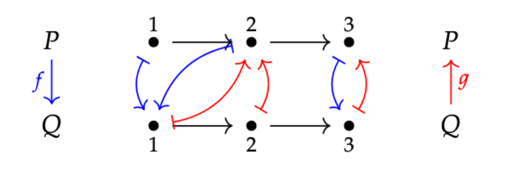

# connections

[](https://travis-ci.com/cmk/connections)

Hosted on [Hackage](https://hackage.haskell.org/package/connections)

This library provides an API for working with Galois connections on various common preorders. Connections are useful for performing lawful conversions between different types, and this library provides substitutes for several of the functions in `base` with erratic or unlawful behavior, such as `fromIntegral`, `fromRational`, `round`, `floor`, `ceiling`, and `truncate`.

## What's a connection?

A [Galois connection](https://en.wikipedia.org/wiki/Galois_connection) between preorders P and Q is a pair of monotone maps `f :: p -> q` and `g :: q -> p` such that `f x <= y` if and only if `x <= g y`. We say that `f` is the left or lower adjoint, and `g` is the right or upper adjoint of the connection.

For example:



Here is a more Haskell-y example, between `Bool` and `Ordering`:

```
ordbin :: Conn 'L Ordering Bool
ordbin = ConnL f g1 where
  f GT = True
  f _  = False

  g1 True = GT
  g1 _    = EQ
```

Interestingly, there is a second 'flipped' connection available as well:

```
binord :: Conn 'L Bool Ordering
binord = ConnL g2 h where
  g2 False = LT
  g2 _     = EQ
  
  h LT = False
  h _  = True
```

It turns out that this happens fairly frequently, and furthermore it is often the case that the two 'inside' functions (`g1` and `g2` here) are identical, thus forming an adjoint [string](https://ncatlab.org/nlab/show/adjoint+string) or chain of length 3 (i.e. `f` is adjoint to `g` is adjoint to `h`). It is useful to be able to work with these length-3 chains directly, because the choice of two routes back from P to Q enables lawful rounding, truncation, etc. 

Therefore the connection type in `Data.Connection.Conn` is parametrized over a data kind (e.g. `'L`) that specifies which pair we are talking about (`f`/`g` or `g`/`h`). When a chain is available the data kind is existentialized (see the view pattern `Conn`).

In our example above, it turns out that a small change in the adjoints on each side enables such a chain:

```
ordbin :: Conn k Ordering Bool
ordbin = Conn f g h
  where
    f i
        | i == LT = False
        | otherwise = True
        
    g False = LT
    g True = GT
    
    h i
        | i == GT = True
        | otherwise = False
```

Astute readers may suspect that there's nothing special about `Ordering` here other that the existence of upper and lower bounds. This is true (modulo the appropriate generalization of 'bound' to a preorder), and you can find the library version of the generalized chain, `extremal`, in `Data.Connection.Class`.
