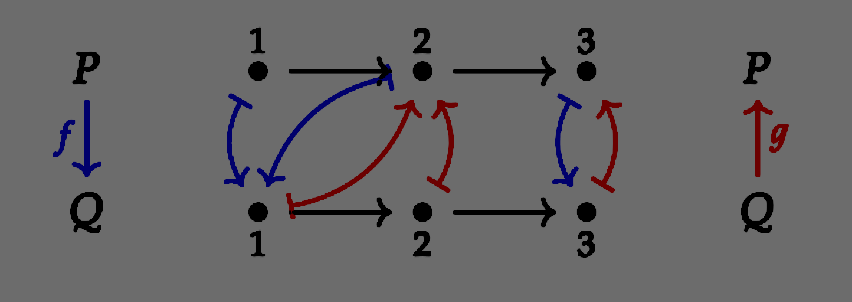

# connections

[](https://gitlab.com/cmk/connections/-/pipelines)

Galois connections as first-class Rust values. Use them to cast lawfully
between numeric types, expose ceiling/floor/inner alongside each other on
the same value, and compose ladders of conversions whose round-trip
behavior is property-tested rather than left to chance.

**MSRV: Rust 1.85.** Bumps to the MSRV will be treated as minor-version
changes — pin `connections = "0.1"` and an MSRV upgrade will surface as
a 0.2 release rather than a silent break on a patch update.

### What is a connection? <a name="intro"></a>

A [Galois connection](https://en.wikipedia.org/wiki/Galois_connection) between 
preorders P and Q is a pair of monotone maps `f :: p -> q` and `g :: q -> p` 
such that `f x <= y` if and only if `x <= g y`. We say that `f` is the left or 
lower adjoint, and `g` is the right or upper adjoint of the connection.

For illustration, here is a simple example from [7 Sketches](https://math.mit.edu/~dspivak/teaching/sp18/7Sketches.pdf):



## Why this exists in Rust

The standard cast operators `as`, `From`, and `Into` give you exactly one
direction at a time — and `as` in particular is silent on rounding,
saturation, and lossy conversion. Three concrete things this crate gives
you that the standard tools don't:

1. **Both arms of a cast on one value.** A `Conn<A, B>` exposes
   `ceil: A → B`, `floor: A → B`, *and* the embedding `inner: B → A` as
   three function pointers on one value. You don't pick "ceiling cast" vs
   "floor cast" up front — you carry both and call whichever you need
   per-call.

2. **Round-trip identities that hold.** `(x as f32) as f64 != x` for many
   `x: f64`. With a `Conn`, the closure law `a ≤ inner(ceil(a))` and
   kernel law `ceil(inner(b)) ≤ b` are property-tested for *every*
   shipped connection. If you compose two connections with `compose!`,
   the result is property-tested too.

3. **Ladders for time work without hand-rolled multipliers.**
   Decimal-second granularities (`FD12` 1 ps ↔ `FD09` 1 ns ↔ `FD06`
   1 µs ↔ `FD03` 1 ms ↔ `FD00` 1 s) ship as named constants.
   Composing across them is one `compose!` invocation, not a chain
   of multiply-divides where one off-by-one breaks the whole
   pipeline. Audio-domain types (sample-rate ladders, rate↔FD12
   cross-tier conns) live in the downstream
   [`agogo`](https://gitlab.com/cmk/agogo) crate.

## The core type

```rust,no_run
pub struct Conn<A, B> {
    ceil:  fn(A) -> B,   // lower adjoint (rounds up)
    inner: fn(B) -> A,   // shared middle adjoint (embedding)
    floor: fn(A) -> B,   // upper adjoint (rounds down)
}
```

A `Conn<A, B>` is an [adjoint
triple](https://ncatlab.org/nlab/show/adjoint+triple) `ceil ⊣ inner ⊣
floor` between two preordered sets. A length-2 (one-sided) connection
sets `floor = ceil`. The struct is `Copy`, `const`-constructible,
heap-free, and the crate is `#![forbid(unsafe_code)]`.

For the math and the rationale behind a single unified `Conn` type
(rather than a Haskell-style `Cast 'L` / `Cast 'R` split), see
[`doc/design.md`](doc/design.md).

## Quick tour

A decimal-ladder cast:

```rust
use connections::conn::std::i64::decimal::{FD09, FD12, FD12FD09};

let p = FD12(1_500);                    // 1500 picoseconds
assert_eq!(FD12FD09.ceil(p),  FD09(2));   // round up   → 2 ns
assert_eq!(FD12FD09.floor(p), FD09(1));   // round down → 1 ns
```

Composing four pair-conns into one `FD12 → FD00` (picoseconds → seconds) cast:

```rust
use connections::compose;
use connections::conn::Conn;
use connections::conn::std::i64::decimal::{FD03FD00, FD06FD03, FD09FD06, FD12FD09, FD00, FD12};

const FD12FD00: Conn<FD12, FD00> = compose!(FD12FD09, FD09FD06, FD06FD03, FD03FD00);
assert_eq!(FD12FD00.floor(FD12(1_500_000_000_000)), FD00(1));  // 1.5 s → 1 s
```

Integer widening through `Extended<T>` (so values *outside* the source
range have somewhere to land — `floor` saturates to the target bounds,
`ceil` lands on a synthetic point one past the source range):

```rust
use connections::conn::std::i16::U008I016;
use connections::extended::Extended;

// Finite passes through.
assert_eq!(U008I016.ceil(Extended::Finite(200_u8)), 200_i16);

// `floor` saturates the infinities to target bounds.
assert_eq!(U008I016.floor(Extended::PosInf), i16::MAX);
assert_eq!(U008I016.ceil(Extended::NegInf),  i16::MIN);

// `ceil(PosInf)` and `floor(NegInf)` land on the "one past source"
// markers — distinct from the target bounds, so `inner` can recover
// PosInf/NegInf round-trip.
assert_eq!(U008I016.ceil(Extended::PosInf),  256_i16);   // u8::MAX + 1
assert_eq!(U008I016.floor(Extended::NegInf), -1_i16);    // u8::MIN - 1
```

`Cast` API — accessors and lifters operating on any `Conn`:

```rust
use connections::{ceiling, upper1, maximize};
use connections::conn::Conn;
use connections::conn::std::i64::decimal::{FD12, FD12FD09};

// `ceiling` is the named alias of `c.ceil` under the L-side reading.
assert_eq!(ceiling(&FD12FD09, FD12(1_500)), FD12FD09.ceil(FD12(1_500)));

// `upper1` lifts an endofunction over the target type back to the source:
//   upper1(c, f, a) = inner(f(ceil(a)))
let bumped = upper1(&FD12FD09, |n| n, FD12(1_500));
assert_eq!(bumped, FD12FD09.inner(FD12FD09.ceil(FD12(1_500))));

// `maximize` is the curried form of `ceiling` over a `Conn<(A, B), C>`.
fn pair_max(p: (i32, i32)) -> i32 { p.0.max(p.1) }
fn diag(x: i32) -> (i32, i32) { (x, x) }
fn pair_min(p: (i32, i32)) -> i32 { p.0.min(p.1) }
let ord: Conn<(i32, i32), i32> = Conn::new(pair_max, diag, pair_min);
assert_eq!(maximize(&ord, 3, 5), 5);
```

A sub-second `Duration` bracketed via the `time`-crate ladder (the same
code block is mirrored verbatim into the `conn::time` module-level
rustdoc, so `cargo test --doc` keeps the two in sync):

```rust
use connections::conn::time::DURNSECS;
use connections::extended::Extended;
use time::Duration;

let half = Duration::seconds(5) + Duration::nanoseconds(1);
assert_eq!(DURNSECS.ceil(half),  Extended::Finite(6));
assert_eq!(DURNSECS.floor(half), Extended::Finite(5));
assert_eq!(DURNSECS.inner(Extended::Finite(42)), Duration::seconds(42));
```

A `Duration` exposed at nanosecond fixed-point (`FD09`):

```rust
use connections::conn::time::DURNFD09;
use connections::conn::std::i64::decimal::FD09;
use connections::extended::Extended;
use time::Duration;

// 1 second = 10⁹ nanoseconds.
assert_eq!(DURNFD09.ceil(Duration::seconds(1)), Extended::Finite(FD09(1_000_000_000)));

// Out-of-range Duration saturates the rung.
assert_eq!(DURNFD09.floor(Duration::MIN), Extended::NegInf);
```

Round-tripping a unix-timestamp through `OffsetDateTime`:

```rust
use connections::conn::time::OFDTNANO;
use connections::extended::Extended;
use time::OffsetDateTime;

assert_eq!(OFDTNANO.inner(0), Extended::Finite(OffsetDateTime::UNIX_EPOCH));
assert_eq!(OFDTNANO.ceil(Extended::Finite(OffsetDateTime::UNIX_EPOCH)), 0);
```

Bracketing an IEEE-float number of seconds with `Duration`:

```rust
use connections::conn::float::ExtendedFloat;
use connections::conn::time::F064DURN;
use connections::extended::Extended;
use time::Duration;

let half_sec = ExtendedFloat::Extend(0.5_f64);
assert_eq!(F064DURN.ceil(half_sec),  Extended::Finite(Duration::milliseconds(500)));
assert_eq!(F064DURN.floor(half_sec), Extended::Finite(Duration::milliseconds(500)));

// f64 NaN: ceil → +∞, floor → -∞ (forced by `Top > Extend(NaN) > Bot`).
let nan = ExtendedFloat::Extend(f64::NAN);
assert_eq!(F064DURN.ceil(nan),  Extended::PosInf);
assert_eq!(F064DURN.floor(nan), Extended::NegInf);
```

A direct `f64 → bfloat16` narrowing — the `half` crate provides a
software-emulated `bf16` (and `f16`) on stable Rust, wrapped with
`ExtendedFloat` so it satisfies `Eq + PartialOrd` and flows through the
law machinery. This block is mirrored verbatim into `F064B016`'s
rustdoc; `cargo test --doc` keeps the two in sync:

```rust
use connections::conn::float::f64::F064B016;
use connections::conn::float::ExtendedFloat::Extend;

// π narrows to bf16. The two-sided round-trip brackets π.
let pi = Extend(std::f64::consts::PI);
let pi_up   = F064B016.ceil(pi);
let pi_down = F064B016.floor(pi);
assert!(F064B016.inner(pi_down) <= pi);
assert!(pi <= F064B016.inner(pi_up));

// f64::MAX saturates to bf16::INFINITY.
let huge = Extend(f64::MAX);
assert_eq!(F064B016.ceil(huge), Extend(half::bf16::INFINITY));
```

The full set of `f64 ↔ f32 ↔ {f16, bf16}` narrowings ships as five
named constants:

| Constant | Source | Target | Module |
|----------|--------|--------|--------|
| `F064F032` | `ExtendedFloat<f64>` | `ExtendedFloat<f32>` | [`conn::float::f64`] |
| `F064F016` | `ExtendedFloat<f64>` | `ExtendedFloat<half::f16>` | [`conn::float::f64`] |
| `F064B016` | `ExtendedFloat<f64>` | `ExtendedFloat<half::bf16>` | [`conn::float::f64`] |
| `F032F016` | `ExtendedFloat<f32>` | `ExtendedFloat<half::f16>` | [`conn::float::f32`] |
| `F032B016` | `ExtendedFloat<f32>` | `ExtendedFloat<half::bf16>` | [`conn::float::f32`] |

Each goes f64/f32 → narrower with RNE rounding, walks ≤ 2 ULPs on the
target side to find the exact ceiling/floor, and saturates extreme
magnitudes to ±∞.

## What's lawful

Every connection ships with proptest coverage of the following laws — the
predicates live in `property::laws` and are re-runnable by downstream
crates against their own connections:

| Law | Statement |
|-----|-----------|
| `conn_galois_l` | `ceil(a) ≤ b ⟺ a ≤ inner(b)` |
| `conn_galois_r` | `inner(b) ≤ a ⟺ b ≤ floor(a)` |
| `conn_closure_l` | `a ≤ inner(ceil(a))` (unit) |
| `conn_closure_r` | `inner(floor(a)) ≤ a` |
| `conn_kernel_l` | `ceil(inner(b)) ≤ b` (counit) |
| `conn_kernel_r` | `b ≤ floor(inner(b))` |
| `conn_monotone_l` | `a₁ ≤ a₂ ⟹ ceil(a₁) ≤ ceil(a₂) ∧ floor(a₁) ≤ floor(a₂)` |
| `conn_monotone_r` | `b₁ ≤ b₂ ⟹ inner(b₁) ≤ inner(b₂)` |
| `conn_idempotent` | `inner ∘ ceil` is idempotent on its image |

A tenth law, `conn_floor_le_ceil` (`floor(a) ≤ ceil(a)`), is asserted
only on connections whose `inner` is a documented injective embedding —
on saturating connections it fails at the saturation plateau by design.
See [`doc/design.md`](doc/design.md) §"Triple-only properties and the
role of injectivity".

For float-bearing types, the `≤` is a [N5 lattice](https://en.wikipedia.org/wiki/Distributive_lattice#Characteristic_properties). 
In particular, NaN is reflexive, NaN sits between ±∞ in the synthetic lattice, 
and finite values are strictly ordered. `ExtendedFloat` carries these semantics.

## What's shipped vs deferred

**Connection families (named consts):**

| Family | Module | Status |
|--------|--------|--------|
| Decimal fixed-point ladder (`FD??FD??`, FD00–FD12) | `conn::std::i64::decimal` | shipped |
| Binary fixed-point (`I###I###`, i8/i16/i32/i64/i128 backing) | `conn::fixed::{i8,i16,i32,i64,i128}` | shipped |
| Std-int widening + narrowing + cross-sign (`I###I###`, `U###I###`, `U###U###`, `I###U###`) | `conn::std::{i8,i16,i32,i64,i128,u8,u16,u32,u64,u128}` | shipped |
| Float `f64 ↔ f32` under N5 | `conn::float` | shipped |
| Float ↔ rung over `ExtendedFloat<T>` (`F064FD??`) | `conn::std::i64::decimal` | shipped |
| `time` crate types (`DATEJDAY`, `TIMENANO`, `TIMESECS`, `DURNSECS`, `DURNFD09`, `F032DURN`, `F064DURN`, `PDTMDATE`, `OFDTNANO`, `OFDTSECS`) | `conn::time` | shipped |
| Audio-domain (sample-rate ladders, rate↔FD12) | downstream [`agogo`](https://gitlab.com/cmk/agogo) crate | moved |

**Cast operations** (Haskell `Data.Connection.Cast`):

| API | Status |
|-----|--------|
| L-side accessors + lifters: `upper`, `upper1`, `upper2`, `ceiling`, `ceiling1`, `ceiling2`, `maximize` | shipped (Sprint A) |
| R-side accessors + lifters: `lower`, `lower1`, `lower2`, `floor`, `floor1`, `floor2`, `minimize` | shipped (Sprint A) |
| Two-sided helpers: `interval`, `midpoint`, `round`/`round1`/`round2`, `truncate`/`truncate1`/`truncate2`, `median` | shipped (Sprint B) |
| Combinators: `bounded`, `ordered` (as macros) | planned (Sprint C) |
| `Down<T>` newtype + `filterL`/`filterR` | planned (Sprint D) |

**Intentionally not ported:**

- The `Side` data kind (`Cast 'L` / `Cast 'R`) — Rust lacks data kinds,
  and a single unified `Conn` carries both sides without compile-time
  bookkeeping. See [`doc/design.md`](doc/design.md) §"Core type" and
  §"Cast: L/R as a naming axis, not a type axis".
- `mapped` (lift a Conn through a `Functor f`) — needs HKTs. Specialize
  per container at the call site if needed.
- A standalone `Preorder` trait — Rust's `PartialOrd` covers most cases;
  the localized `Ple` handles the float-N5 corner. See
  [`doc/design.md`](doc/design.md) §"Why not a custom `Preorder` trait".

## Relationship to the Haskell `connections` library

This crate is a port of the Haskell library
[`connections`](https://github.com/cmk/connections/) (same author, same
mathematical content, different ergonomic trade-offs). The faithful
parts:

- The lattice trait hierarchy (`Join`, `Meet`, `Heyting`, `Coheyting`,
  `Symmetric`, `Boolean`).
- The N5 ordering on float-bearing types via `Ple` and
  `ExtendedFloat<T>`.
- The connection families (decimal/binary fixed-point, sample rates,
  integer widening, float pairs).
- The Cast API (Sprint A onward).

The deliberate divergences:

- One `Conn<A, B>` type instead of `Cast (k :: Side) a b`. Both
  L-side and R-side accessors are free functions on the unified type.
- Composition is a `compose!` macro over module-scope `const`s, not a
  generic `Category` instance. The trade-off is documented in
  [`doc/design.md`](doc/design.md) §"Composition".
- No `Preorder` class; `PartialOrd` + the localized `Ple` trait covers
  the cases that matter.

## Layout

```text
src/
├── lib.rs              — crate root + Cast API re-exports
├── conn.rs             — Conn struct, compose! macro, identity
├── conn/
│   ├── cast.rs         — L/R accessors + lifters (Sprint A)
│   ├── fixed/          — decimal & binary fixed-point ladders
│   ├── float.rs        — ExtendedFloat<T> + f64↔f32
│   ├── int.rs          — signed-widening via Extended<T>
│   ├── sample.rs       — sample-rate ladders + FD12↔rate
│   ├── time/           — time-crate types (Date, Time, Duration, OffsetDateTime)
│   │   ├── date.rs     — Date conns (DATEJDAY)
│   │   ├── clock.rs    — Time conns (TIMENANO, TIMESECS)
│   │   ├── duration.rs — Duration conns (DURNSECS, DURNFD09, F064DURN, F032DURN)
│   │   ├── datetime.rs — PrimitiveDateTime conns (PDTMDATE)
│   │   └── offset.rs   — OffsetDateTime conns (OFDTNANO, OFDTSECS)
│   └── uint.rs         — unsigned widening, sign change
├── extended.rs         — Extended<T> with NegInf/Finite/PosInf
├── lattice.rs          — Join, Meet, Heyting, Coheyting, Symmetric, Boolean
└── property/           — proptest strategies + law predicates
```

## Testing

```sh
cargo test --workspace
```

Every connection runs its `proptest` law suite on every commit (the
pre-commit hook in `.claude/settings.json` enforces this). Float
generators are biased toward NaN, ±∞, ±0, denormals, and ULP-boundary
values. Fixed-point generators are biased toward `0`, `±PREC`, and
`±i64::MAX/PREC` so saturation boundaries are exercised on every run.

Runtime dependencies are the [`fixed`](https://crates.io/crates/fixed)
crate (binary fixed-point ladder) and the
[`time`](https://crates.io/crates/time) crate (calendar / clock /
duration types in `conn::time`). Proptest is a dev-dependency, exposed
publicly behind the `testing` feature for downstream test suites.

## Links

- [`doc/design.md`](doc/design.md) — full design rationale, including
  the math, the N5 lattice, and the per-axis trade-offs.
- [GitLab project](https://gitlab.com/cmk/connections) — issues, MRs,
  and CI.
- [Haskell `connections`](https://github.com/cmk/connections/) — the
  upstream library this port mirrors.
- [nLab: Galois connection](https://ncatlab.org/nlab/show/Galois+connection) —
  background reading.
