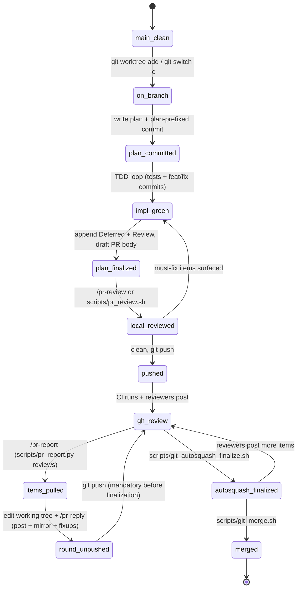
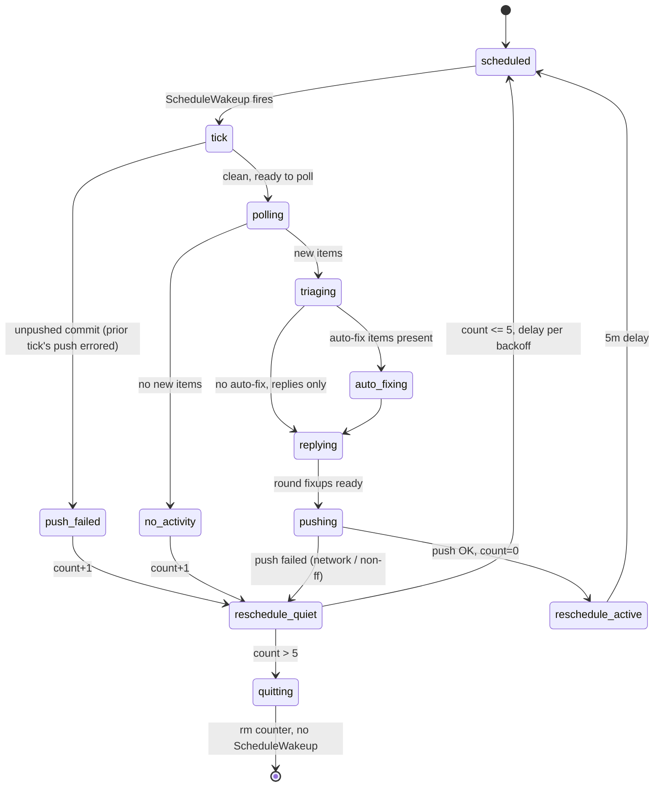

# Workflow State Diagrams

Visual reference for the review-round and `/pr-watch` workflows defined
in `../AGENTS.md`. The prose specs there are authoritative; these
diagrams exist to make the state transitions easier to eyeball when
debugging an unexpected situation — a stuck fix commit, a loop that
won't quit, an ordering question about when to run which command.

GitHub renders mermaid in markdown natively, so both diagrams below
show up as real graphs on the PR page.

## Review round lifecycle

One sprint from `main` through merge, covering Tier 1 (local) review,
Tier 2 (GitHub) rounds, and the fix-edits → reply → mirror → fixup →
push → autosquash motion that `/pr-reply` and finalization enforce.



**Legend:**
- `round_unpushed` is the load-bearing state — one review round
  sitting unpushed on the local branch. Mechanical code/test/product-doc
  fixes are `fixup!` commits against the implementation commit they
  repair; review-doc mirror changes are a separate `fixup!` against
  the finalized-doc commit. Design-changing feedback may remain a
  standalone `fix:` or `feat:` commit, still paired with a review-doc
  fixup when the mirror changed.
- The `gh_review → items_pulled → round_unpushed → gh_review` cycle
  runs once per review round. The transition out of `round_unpushed`
  is `git push` — that's the only way to return to GitHub review.
  Mergeability requires a later `autosquash_finalized` pass.
- **Never merge from `round_unpushed`.** There is no
  `round_unpushed → merged` edge in the FSM — only `gh_review →
  autosquash_finalized → merged`. `gh pr merge` is GitHub-side and
  doesn't see local state, so a merge with an unpushed round silently
  drops the local commit.
  Use `scripts/git_merge.sh <pr-args>` instead of `gh pr merge` —
  it refuses to invoke the merge while the local branch is ahead of
  origin. (Equivalent local check: `git log origin/<branch>..HEAD
  --oneline` must be empty.)
- **Never merge before `autosquash_finalized`.** Review fixups may be
  pushed during the review loop so CI and reviewers see the response,
  but main should receive the cleaned branch. Run
  `scripts/git_autosquash_finalize.sh`; it autosquashes against
  `origin/main`, reruns full gates, and force-pushes with lease.
  `scripts/git_merge.sh` refuses PR heads that still contain
  `fixup!`, `amend!`, or `squash!` commits.
- `local_reviewed → impl_green` is the must-fix loop-back. The fix
  commits stay on the same branch; re-append any new Deferred/Review
  notes, then re-run the local review transition (`/pr-review` for
  Claude Code, `scripts/pr_review.sh` for Codex/shell) against the
  new tip.
- Review triage follows AGENTS.md's
  [gardener rule](../AGENTS.md#the-gardener-rule):
  "optional", "follow-up", suppressed, and low-confidence comments are
  treated seriously unless they are large, complex, out of scope, or
  incorrect.
- `plan_finalized` sits deliberately *before* `local_reviewed`: the
  reviewer reads the plan as context and should see its final form,
  including what was intentionally cut and why. It's also when
  `doc/reviews/review-NNNNN.md` is created with the PR body under
  `## Summary`. Committing the description pre-push is what lets a
  silent PR merge without an extra round-trip — `gh pr create`
  feeds GitHub a direct copy via `scripts/pr_report.py body`.

**Recovery: stranded round commit after merge from `round_unpushed`.**

If a merge happened while the round was at `round_unpushed` (i.e.
`git_merge.sh` was bypassed and `gh pr merge` was used directly) and
the local commit got stranded, the round-2 work isn't lost — it's
sitting on the local feature branch's tip. Don't open a tiny
standalone PR for it; per repo convention, fold the stranded commit
into the next plan branch's first commit:

```
# On the next plan branch, after the plan: commit:
git cherry-pick <stranded-sha>
# Squash into the first feat/fix commit you make on this branch,
# OR keep as a separate `fix:` commit if the change stands alone.
```

The previously-posted GitHub replies remain accurate (they reference
the right SHAs at the time of posting). The next PR's review file
should reference the prior PR's `gh-id` URLs in a `### History`
section so the chain isn't orphaned.

**Recovery: partial reply-post failure mid-`/pr-reply`.**

If `scripts/pr_reply.py` fails partway through the post loop
(network, rate limit, auth), `/pr-reply` aborts before the
mirror+commit step. Some replies are on GitHub, some aren't; the
working tree still has the uncommitted code edits but no mirrored
doc changes. Recovery is a re-run of `/pr-reply`:

1. Step 1's `pr_report.py reviews` mirrors the already-posted replies into
   the doc.
2. Step 2's "unreplied threads" filter skips threads with mirrored
   replies — so we only post the missing ones.
3. The rest of the run completes normally.

`pr_reply.py` is **not** idempotent server-side — calling it
twice with the same `in_reply_to_id` posts twice. Idempotency comes
from the "skip already-replied threads" filter, which depends on the
mirror happening *before* the post loop. Don't bypass Step 1.

## `/pr-watch` dynamic-mode loop

The `/loop /pr-watch <N>` self-pacing loop, with its 5/5/5/10/10-minute
backoff and auto-quit on the 6th consecutive quiet tick (after the
5-slot backoff is exhausted). Counter state lives in
`.pr-watch/pr-<N>.count` (gitignored).



**Legend:**
- `push_failed` is the recovery state when a previous tick's
  `git push` errored (network, non-fast-forward). The next tick
  retries only if `.pr-watch/pr-<N>.push-failed-head` matches the
  current `HEAD`; otherwise it surfaces the unpushed commit to the user
  without polling further. It counts as a quiet tick — successive
  failures still trigger backoff and quit.
- `reschedule_quiet` reads the backoff table: count 1→5m, 2→5m, 3→5m,
  4→10m, 5→10m, >5 → quit (total silence budget ≈ 35 minutes).
- Any `reschedule_active` edge resets the counter to 0, so a burst of
  review activity mid-backoff restores the 5-minute cadence.
- `quitting` terminates the dynamic loop: the state file is removed
  and `ScheduleWakeup` is deliberately *not* called. A fixed-interval
  loop (`/loop 5m /pr-watch <N>`) has no backoff and no quit — it
  runs until the user kills it.

## When a diagram disagrees with AGENTS.md

AGENTS.md wins. These are derived views; re-draw them when the
workflow prose changes. A lagging diagram is worse than no diagram.
