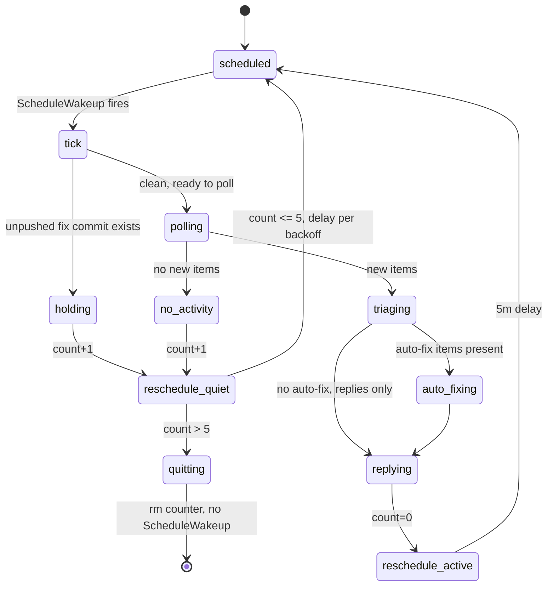

# Workflow State Diagrams

Visual reference for the review-round and `/watch-mr` workflows defined
in `../CLAUDE.md`. The prose specs there are authoritative; these
diagrams exist to make the state transitions easier to eyeball when
debugging an unexpected situation — a stuck fix commit, a loop that
won't quit, an ordering question about when to run which command.

GitLab renders mermaid in markdown natively, so both diagrams below
show up as real graphs on the MR page.

## Review round lifecycle

One sprint from `main` through merge, covering Tier 1 (local) review,
Tier 2 (GitLab) rounds, and the fix → reply → mirror → amend → push
motion that `/reply-reviews` enforces.

```mermaid
stateDiagram-v2
    [*] --> main_clean
    main_clean --> on_branch: git worktree add / git switch -c
    on_branch --> plan_committed: write plan + plan-prefixed commit
    plan_committed --> impl_green: TDD loop (tests + feat/fix commits)
    impl_green --> plan_finalized: append Deferred + Review, draft MR description
    plan_finalized --> local_reviewed: /sprint-review
    local_reviewed --> impl_green: must-fix items surfaced
    local_reviewed --> pushed: clean, git push -o ci.skip
    pushed --> glab_review: glab mr create; CI runs
    glab_review --> items_pulled: /pull-reviews
    items_pulled --> fix_unpushed: address items, local fix commit
    fix_unpushed --> replies_amended: /reply-reviews (post + mirror + amend)
    replies_amended --> glab_review: git push (code + replies + doc in one trip)
    glab_review --> merged: no more items, rebase + ff to main
    merged --> [*]
```

**Legend:**
- `fix_unpushed` is the load-bearing state. `/reply-reviews` refuses
  to run outside it, so the reply mirror never ends up stranded in the
  working tree.
- `main_clean` is the shared coordination state. Do not perform task
  edits in the primary checkout; create or switch to a task worktree
  before changing files so other agents can continue to rely on the
  root checkout.
- The `glab_review → items_pulled → fix_unpushed → replies_amended → glab_review`
  cycle runs once per review round. Pushing before the amend breaks
  the cycle — it forces either a wasted `doc:` commit (extra CI
  round-trip) or a disallowed force-push.
- Reply posting is part of the same state transition, not a side
  channel. The corrected transition is: post replies through
  `scripts/reply_review.py`, mirror with `scripts/pull_reviews.py`,
  verify the mirrored Markdown is uncorrupted, amend it into the
  unpushed fix commit, then push once. The failure mode this prevents
  is shell-quoted Markdown or raw `glab` calls corrupting a reply while
  leaving no verified mirror in `doc/reviews`.
- `local_reviewed → impl_green` is the must-fix loop-back. The fix
  commits stay on the same branch; re-append any new Deferred/Review
  notes, then `/sprint-review` re-runs against the new tip.
- `local_reviewed → pushed` uses `ci.skip` only for the first branch
  publication. Before the MR exists, GitLab cannot suppress the
  duplicate branch pipeline; `glab mr create` starts the canonical MR
  pipeline immediately afterward.
- `plan_finalized` sits deliberately *before* `local_reviewed`: the
  reviewer reads the plan as context and should see its final form,
  including what was intentionally cut and why. It's also when
  `doc/reviews/review-NNNNN.md` is created with the MR description
  under `## Summary`. Committing the description pre-push is what
  lets a silent MR merge without an extra round-trip — `glab mr create`
  feeds GitLab a direct copy via `scripts/extract_mr_body.sh`.

## `/watch-mr` dynamic-mode loop

The `/loop /watch-mr <N>` self-pacing loop, with its 5/5/5/10/10-minute
backoff and auto-quit on the 6th consecutive quiet tick (after the
5-slot backoff is exhausted). Counter state lives in
`.watch-mr/mr-<N>.count` (gitignored).

**Legend:**
- `holding` is not a failure — it's the safety valve that keeps the
  loop from stepping on a fix commit you haven't reviewed and pushed.
  It still counts as a quiet tick.
- `reschedule_quiet` reads the backoff table: count 1→5m, 2→5m, 3→5m,
  4→10m, 5→10m, >5 → quit (total silence budget ≈ 35 minutes).
- Any `reschedule_active` edge resets the counter to 0, so a burst of
  review activity mid-backoff restores the 5-minute cadence.
- `quitting` terminates the dynamic loop: the state file is removed
  and `ScheduleWakeup` is deliberately *not* called. A fixed-interval
  loop (`/loop 5m /watch-mr <N>`) has no backoff and no quit — it
  runs until the user kills it.

## When a diagram disagrees with CLAUDE.md

CLAUDE.md wins. These are derived views; re-draw them when the
workflow prose changes. A lagging diagram is worse than no diagram.
